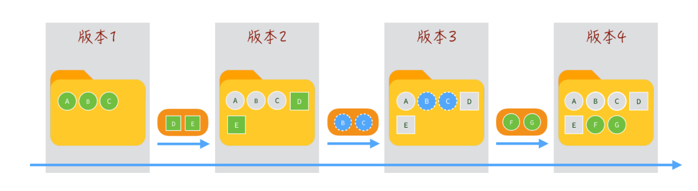
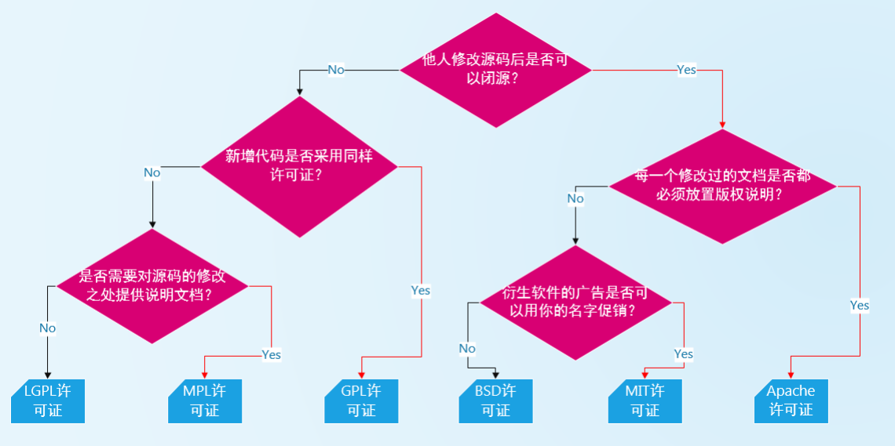
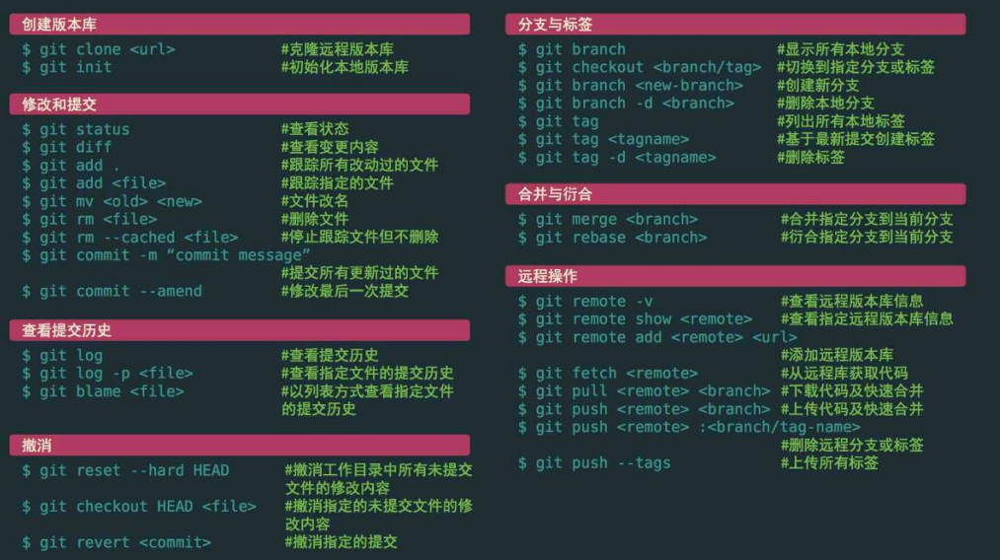

# 版本控制工具

## 认识版本控制（版本控制）

- 什么是版本控制？

    - 版本控制的英文是Version control
    - 是维护工程蓝图的标准作法，能追踪工程蓝图从诞生一直到定案的过程
    - 版本控制也是一种软件工程技巧，借此能在软件开发的过程中，确保由不同人所编辑的同一程序文件都得到同步
- 简单来说，版本控制在软件开发中，可以帮助程序员进行代码的追踪、维护、控制等等一系列的操作。


## 版本控制的功能

-  对于我们日常开发，我们常常面临如下一些问题，通过版本控制可以很好的解决

- 不同版本的存储管理：
    - 一个项目会不断进行版本的迭代，来修复之前的一些问题、增加新的功能、需求，甚至包括项目的重构
    - 如果我们通过手动来维护一系列的项目备份，简直是一场噩梦
- 重大版本的备份维护
    - 对于很多重大的版本，我们会进行备份管理
- 恢复之前的项目版本
    - 当我们开发过程中发生一些严重的问题时，想要恢复之前的操作或者回到之前某个版本
- 记录项目的点点滴滴
    - 如果我们每一个功能的修改、bug的修复、新的需求更改都需要记录下来，版本控制可以很好的解决
- 多人开发的代码合并
    - 项目中通常都是多人开发，将多人代码进行合并，并且在出现冲突时更好的进行处理

## 版本控制的历史

- 版本控制的史前时代（没有版本控制）

    - 人们通常通过文件备份的方式来进行管理，再通过diff命令来对比两个文件的差异
- CVS（Concurrent Versions System）
    - 第一个被大规模使用的版本控制工具，诞生于1985年
    - 由荷兰阿姆斯特丹VU大学的Dick Grune教授实现的，也算是SVN的前身（SVN的出现就是为了取代CVS的）
- SVN（Subversion）
    - 因其命令行工具名为svn因此通常被简称为SVN
    - SVN由CollabNet公司于2000年资助并发起开发，目的是取代CVS，对CVS进行了很多的优化
    - SVN和CVS一样，也属于集中式版本控制工具
    - SVN在早期公司开发中使用率非常高，但是目前已经被Git取代
-  Git（Linus的作品）
    - 早期的时候，Linux社区使用的是BitKeeper来进行版本控制
    - 但是因为一些原因，BitKeeper想要收回对Linux社区的免费授权
    - 于是Linus用了大概一周的时间，开发了Git用来取代BitKeeper
    - Linus完成了Git的核心设计，在之后Linus功成身退，将Git交由另外一个Git的主要贡献者Junio C Hamano来维护

# 集中式和分布式区别

## 集中式版本控制

- CVS和SVN都是是属于集中式版本控制系统（Centralized Version Control Systems，简称 CVCS）

    - 它们的主要特点是单一的集中管理的服务器，保存所有文件的修订版本
    - 协同开发人员通过客户端连接到这台服务器，取出最新的文件或者提交更新
- 这种做法带来了许多好处，特别是相较于老式的本地管理来说，每个人都可以在一定程度上看到项目中的其他人正在做些什么
- 但是集中式版本控制也有一个核心的问题：中央服务器不能出现故障
    - 如果宕机一小时，那么在这一小时内，谁都无法提交更新，也就无法协同工作
    -  如果中心数据库所在的磁盘发生损坏，又没有做恰当备份，毫无疑问你将丢失所有数据

## 分布式版本控制

- Git是属于分布式版本控制系统（Distributed Version Control System，简称 DVCS）
    
    - 客户端并不只提取最新版本的文件快照， 而是把代码仓库完整地镜像下来，包括完整的历史记录
    - 这么一来，任何一处协同工作用的服务器发生故障，事后都可以用任何一个镜像出来的本地仓库恢复
    - 因为每一次的克隆操作，实际上都是一次对代码仓库的完整备份


# Git的环境安装搭建

## Git的安装

- 电脑上要想使用Git，我们需要先对Git进行安装：
    - Git的官网：https://git-scm.com/downloads
    - 根据自己的操作系统下载Git即可；
    - 在window操作系统按照默认配置全局安装即可

- Bash – CMD – GUI 区别
    - Bash，Unix shell 的一种，Linux 与 Mac OS X 都将它作为默认 shell
    - Git Bash 就是一个 shell，是 Windows 下的命令行工具，可以执行 Linux 命令
    - Git Bash 是基于 CMD 的，在 CMD 的基础上增添一些新的命令与功能
    - 所以建议在使用的时候，用 Bash 更加方便
    - Git CMD
    - 命令行提示符（CMD）是 Windows 操作系统上的命令行解释程序
    - 当你在 Windows 上安装 git 并且习惯使用命令行时，可以使用 cmd 来运行 git 命令
    -  Git GUI
    - 基本上针对那些不喜欢黑屏（即命令行）编码的人
    -  它提供了一个图形用户界面来运行 git 命令

## Git的配置分类

-  安装Git后，要做的第一件事就是设置你的用户名和邮件地址
    - 这一点很重要，因为每一个 Git 提交都会使用这些信息，它们会写入到你的每一次提交中，不可更改
    - 如果使用了 --global 选项，那么该命令只需要运行一次，因为之后无论你在该系统上做任何事情， Git 都会使用那些信息
```JS
    git config --global user.name "huangyulie"
    git config --global user.email "1279072972@qq.com"
```
- 检测当前的配置信息：git config --list

## Git的别名（alias）

- Git 并不会在你输入部分命令时自动推断出你想要的命令
    - 如果不想每次都输入完整的 Git 命令，可以通过 git config 文件来轻松地为每一个命令设置一个别名

```js
    git config --global alias.co checkout
    git config --global alias.br branch
    git config --global alias.ci commit
    git config --global alias.st status
```

git checkout === git co

# Git初始化本地仓库

## 获取Git仓库 – git init/git clone

- 我们需要一个Git来管理源代码，那么我们本地也需要有一个Git仓库
- 通常有两种获取 Git 项目仓库的方式：
    - 方式一：初始化一个Git仓库，并且可以将当前项目的文件都添加到Git仓库中
    - 方式二：从其他服务器克隆一个已存在的Git仓库
- 方式一：初始化Git仓库**git init**
    - 该命令将创建一个名为.git的子目录，这个子目录含有你初始化的Git仓库中所有的必须文件，这些文件是Git仓库的核心
    - 但是，在这个时候，我们仅仅是做了一个初始化的操作，你的项目里的文件还没有被跟踪
- 方式二：从Git远程仓库
> git clone git@github.com:huangyulie/MirokuBlogs.git

# Git记录更新变化过程

## 文件的状态划分

- 现在我们的电脑上已经有一个Git仓库

    - 在实际开发中，你需要将某些文件交由这个Git仓库来管理
    - 并且我们之后会修改文件的内容，当达成某一个目标时，想要记录下来这次操作，就会将它提交到仓库中

- 那么我们需要对文件来划分不同的状态，以确定这个文件是否已经归于Git仓库的管理：

    - 未跟踪：默认情况下，Git仓库下的文件也没有添加到Git仓库管理中，我们需要通过add命令来操作
    - 已跟踪：添加到Git仓库管理的文件处于已跟踪状态，Git可以对其进行各种跟踪管理

- 已跟踪的文件又可以进行细分状态划分
    - staged:  暂缓区中的文件状态
    - UNmodified：commit命令，可以将staged中文件提交到Git仓库
    - Modified：修改了某个文件后，会处于Modified状态

- 在工作时，你可以选择性地将这些修改过的文件放入暂存区

- 然后提交所有已暂存的修改，如此反复

## 检测文件的状态 - git status

- 我们在有Git仓库的目录下新建一个文件，查看文件的状态

> git status

- Untracked files：未跟踪的文件

    - 未跟踪的文件意味着 Git 在之前的提交中没有这些文件；
    - Git 不会自动将之纳入跟踪范围，除非你明明白白地告诉它“我需要跟踪该文件"

## 文件添加到暂存区 – git add

- 跟踪新文件命令

> git add index.js 使用命令git add 开始跟踪一个文件

- 跟踪修改的文件命令

    - 如果我们已经跟踪了某一个文件，这个时候修改了文件也需要重新添加到暂存区中

- 通过git add . 将所有的文件添加到暂存区中

> git add .

## git忽略文件

- 一般我们总会有些文件无需纳入 Git 的管理，也不希望它们总出现在未跟踪文件列表

    - 通常都是些自动生成的文件，比如日志文件，或者编译过程中创建的临时文件等
    - 我们可以创建一个名为.gitignore的文件。列出要忽略的文件的模式

- 在实际开发中，这个文件通常不需要手动创建，在必须的时候添加自己的忽略内容

```js
    //例子
    node_modules
    /dist
```

## 文件更新提交 – git commit

- 现在的暂存区已经准备就绪，可以提交了

    - 每次准备提交前，先用 git status 看下，你所需要的文件是不是都已暂存起来了
    - 再运行提交命令 git commit
    - 可以在 commit 命令后添加 -m 选项，将提交信息与命令放在同一行
> git commit -m "提交信息"

- 如果我们修改文件的add操作，加上commit的操作有点繁琐，那么可以将两个命令结合来使用

> git commit -a -m "提交信息"

## 查看提交的历史 – git log

- 在提交了若干更新，又或者克隆了某个项目之后，有时候我们想要查看一下所有的历史提交记录

- 这个时候我们可以使用git log命令

    - 不传入任何参数的默认情况下，git log 会按时间先后顺序列出所有的提交，最近的更新排在最上面
    - 这个命令会列出每个提交的 SHA-1 校验和、作者的名字和电子邮件地址、提交时间以及提交说明

```js
    git log 
    git log --pretty=oneline //简单展示
    git log --pretty=oneline --graph //图形展示，就是能看到分支啥的
```

## 版本回退 – git reset

- 如果想要进行版本回退，我们需要先知道目前处于哪一个版本：Git通过HEAD指针记录当前版本

    - HEAD 是当前分支引用的指针，它总是指向该分支上的最后一次提交
    - 理解HEAD的最简方式，就是将它看做该分支上的最后一次提交的快照

- 我们可以通过HEAD来改变GIt目前的版本指向

    - 上一个版本就是HEAD^,上上一个版本就是HEAD^^
    - 如果是上1000个版本，我们可以使用HEAD~1000
    - 我们可以指定某一个commit id

```js
    git reset --hard HEAD^
    git reset --hard HEAD~1000
    git reset --hard 1hdsa12
```
# Git远程仓库和验证

## 什么是远程仓库

- 什么是远程仓库（Remote Repository）呢

    - 目前我们的代码是保存在一个本地仓库中，也就意味着我们只是在进行本地操作
    - 在真实开发中，我们通常是多人开发的，所以我们会将管理的代码共享到远程仓库中

- 那么如何创建一个远程仓库呢

    - 远程仓库通常是搭建在某一个服务器上的（当然本地也可以，但是本地很难共享）
    - 所以我们需要在Git服务器上搭建一个远程仓库

- 目前我们有如下方式可以使用Git服务器

    - 使用第三方的Git服务器：比如GitHub、Gitee、Gitlab等等
    - 在自己服务器搭建一个Git服务

## 远程仓库的验证

- 常见的远程仓库有哪些呢？目前比较流行使用的是三种

    - Github
    - Gitee
    - Gitlab

- 对于私有的仓库我们想要进行操作，远程仓库会对我们的身份进行验证

    - 如果没有验证，任何人都可以随意操作仓库是一件非常危险的事情

- 目前GIt服务器验证手段主要有两种

    - 方式一：基于HTTP的凭证存储
    - 方式二：基于SSH的秘钥

## 远程仓库的验证 – Http凭证

- 因为本身HTTP协议是无状态的连接，所以每一个连接都需要用户名和密码
    
    - 如果每次都这样操作，那么会非常麻烦
    - 幸运的是，Git拥有一个凭证系统来处理这个事情

## 远程仓库的验证 – SSH密钥

- Secure Shell（安全外壳协议，简称SSH）是一种加密的网络传输协议，可在不安全的网络中为网络服务提供安全的传输环境

- SSH以非对称加密实现身份验证

    - 例如其中一种方法是使用自动生成的公钥-私钥对来简单地加密网络连接，随后使用密码认证进行登录
    - 另一种方法是人工生成一对公钥和私钥，通过生成的密钥进行认证，这样就可以在不输入密码的情况下登录
    -  公钥需要放在待访问的电脑之中，而对应的私钥需要由用户自行保管

- 如果我们以SSH的方式访问Git仓库，那么就需要生产对应的公钥和私钥

> ssh-keygen -t ed25519 -C “your email"

> ssh-keygen -t rsa -b 2048 -C “your email"

## 管理远程服务器

- 查看远程地址：比如我们之前从GitHub上clone下来的代码，它就是有自己的远程仓库的
```js
    git remote
    git remote -v
    //-v是-verbose的缩写(冗杂的),展示更多信息
```
- 添加远程地址：我们也可以继续添加远程服务器（让本地的仓库和远程服务器仓库建立连接）
```js
    git remote add <shortname> <url>
    git remoteadd gitlab http://192.148.123.2:2000/Miroku.git
```

- 重命名远程地址：git remote rename gitlab glab
- 移除远程地址： git remote remove gitlab

## 本地分支的上游分支（跟踪分支）

- 问题一：当前分支没有track的分支


- 原因：当前分支没有和远程的origin/master分支进行跟踪
    - 在没有跟踪的情况下，我们直接执行pull操作的时候必须指定从哪一个远程仓库中的哪一个分支中获取内容
> 采用git pull origin master

- 如果我们想要直接执行git fetch是有一个前提的：必须给当前分支设置一个跟踪分支

> git branch --set-upstream-to=origin/master

## 远程仓库的交互

- 从远程仓库clone代码：将存储库克隆到新创建的目录中
> git clone git@github.com:huangyulie/MirokuBlogs.git
- 将代码push到远程仓库：将本地仓库的代码推送到远程仓库中

    - 默认情况下是将当前分支（比如master）push到origin远程仓库的
    > git push origin master
-  从远程仓库fetch代码：从远程仓库获取最新的代码

    - 默认情况下是从origin中获取代码
    > git fetch origin
    - 获取到代码后默认并没有合并到本地仓库，我们需要通过merge来合并
    > git merge

- 从远程仓库pull代码：上面的两次操作有点繁琐，我们可以通过一个命令来操作

    - git pull = git fetch + git merge

## 合并冲突（conflict）

- 上面我们通过pull从Git远程仓库获取到分支内容后会自动进行合并（merge）
- 但是并非所有的情况都可以正常的合并，某些情况下合并会出现冲突
- 手动接冲突就行了

## 常见的开源协议




# Git的标签tag用法

## Git标签（tag） - 创建tag

-  对于重大的版本我们常常会打上一个标签，以表示它的重要性

    - Git 可以给仓库历史中的某一个提交打上标签
    - 比较有代表性的是人们会使用这个功能来标记发布结点（ v1.0 、 v2.0 等等）

-  创建标签

    - Git 支持两种标签：轻量标签（lightweight）与附注标签（annotated）
    - 附注标签：通过-a选项，并且通过-m添加额外信息
    > git tag v10,git tag -a v1.1 -m "附注标签"

- 默认情况下，git push 命令并不会传送标签到远程仓库服务器上

    - 在创建完标签后你必须显式地推送标签到共享服务器上，当其他人从仓库中克隆或拉取，他们也能得到你的那些标签
    > git push origin v1.0 , git push origin --tags

## Git标签（tag） - 删除和检出tag

- 删除本地tag

    - 要删除掉你本地仓库上的标签，可以使用命令 git tag -d <tagname>

- 删除远程tag：

    - 要删除远程的tag我们可以通过git push <remote> –delete <tagname>

- 检出tag：

    - 如果你想查看某个标签所指向的文件版本，可以使用 git checkout 命令
    - 通常我们在检出tag的时候还会创建一个对应的分支
# Git分支的使用过程

## Git提交对象

- 几乎所有的版本控制系统都以某种形式支持分支

    - 使用分支意味着你可以把你的工作从开发主线上分离开来，以免影响开发主线

- 在进行提交操作时，Git 会保存一个提交对象

    - 该提交对象会包含一个指向暂存内容快照的指针
    - 该提交对象还包含了作者的姓名和邮箱、提交时输入的信息以及指向它的父对象的指针

## Git master分支

- Git 的分支，其实本质上仅仅是指向提交对象的可变指针

    - Git 的默认分支名字是 master，在多次提交操作之后，你其实已经有一个指向最后那个提交对象的 master 分支
    -  master 分支会在每次提交时自动移动

- Git 的 master 分支并不是一个特殊分支

    - 它就跟其它分支完全没有区别
    - 之所以几乎每一个仓库都有 master 分支，是因为 git init 命令默认创建它，并且大多数人都懒得去改动它

## Git创建分支

- Git 是怎么创建新分支的呢

    -  很简单，它只是为你创建了一个可以移动的新的指针

- 比如，创建一个 testing 分支， 你需要使用 git branch 命令
>   git branch testing 

- 那么，Git 又是怎么知道当前在哪一个分支上呢？

    - 也很简单，它也是通过一个名为 HEAD 的特殊指针；
> git checkout testing

## Git分支提交

- 如果我们指向某一个分支，并且在这个分支上提交
- 你也可以切换回到master分支，继续开发

## 创建分支同时切换

- 创建新分支的同时切换过去

    - 通常我们会在创建一个新分支后立即切换过去
    - 这可以用 git checkout -b <newbranchname> 一条命令搞定

## 为什么需要使用分支呢

- 让我们来看一个简单的分支新建与分支合并的例子，实际工作中你可能会用到类似的工作流

    - 开发某个项目，在默认分支master上进行开发
    - 实现项目的功能需求，不断提交
    - 并且在一个大的版本完成时，发布版本，打上一个tag v1.0.0

- 继续开发后续的新功能，正在此时，你突然接到一个电话说有个很严重的问题需要紧急修补， 你将按照如下方式来处理

    - 切换到tag v1.0.0的版本，并且创建一个分支hotfix

- 想要新建一个分支并同时切换到那个分支上，你可以运行一个带有 -b 参数的 git checkout 命令
> git checkout -b hotfix

## 分支开发和合并

- 分支上开发、修复bug

    - 我们可以在创建的hotfix分支上继续开发工作或者修复bug
    - 当完成要做的工作后，重新打上一个新的tag v1.0.1

- 切换回master分支，但是这个时候master分支也需要修复刚刚的bug
    -  所以我们需要将master分支和hotfix分支进行合并

```js
    git checkout master
    git merge hotfix
```

## 查看和删除分支

- 如果我们希望查看当前所有的分支，可以通过以下命令
```js
    git branch // 查看当前所有的分支 
    git branch -v //  同时查看最后一次提交
    git branch --merged // 查看所有合并到当前分支的分支
    git branch --no-merged // 查看所有没有合并到当前分支的分支
```
- 如果某些已经合并的分支我们不再需要了，那么可以将其移除掉
```js
    git branch -d hotfix // 删除当前分支
    git branch -D hotfix //强制删除某一个分支
```
# 工作中的Git Flow

## Git的工作流

-  由于Git上分支的使用的便捷性，产生了很多Git的工作流

    - 也就是说，在整个项目开发周期的不同阶段，你可以同时拥有多个开放的分支
    - 你可以定期地把某些主题分支合并入其他分支中

- 比如以下的工作流

    - master作为主分支
    - develop作为开发分支，并且有稳定版本时，合并到master分支中
    - topic作为某一个主题或者功能或者特性的分支进行开发，开发完成后合并到develop分支中

# Git远程分支的管理

## Git的远程分支

- 远程分支是也是一种分支结构
    - 以 <remote>/<branch> 的形式命名的
## 远程分支的管理

- 操作一：推送分支到远程

    - 当你想要公开分享一个分支时，需要将其推送到有写入权限的远程仓库上
    - 运行 git push <remote> <branch>
    > git push origin <branch>

- 操作二：跟踪远程分支

    - 当克隆一个仓库时，它通常会自动地创建一个跟踪 origin/master 的 master 分支
    - 如果你愿意的话可以设置其他的跟踪分支，可以通过运行 git checkout --track <remote>/<branch>
    - 如果你尝试检出的分支 (a) 不存在且 (b) 刚好只有一个名字与之匹配的远程分支，那么 Git 就会为你创建一个跟踪分支
    > git checkout --track <remote>/<branch> , git checkout <branch>

- 操作三：删除远程分支

    - 如果某一个远程分支不再使用，我们想要删除掉，可以运行带有 --delete 选项的 git push 命令来删除一个远程分支
    > git push origin --delete <branch> 
# Git rebase的使用

- 在 Git 中整合来自不同分支的修改主要有两种方法：merge 以及 rebase
- 什么是rebase呢

    - 在上面的图例中，你可以提取在 C4 中引入的补丁和修改，然后在 C3 的基础上应用一次
    - 在 Git 中，这种操作就叫做 变基（rebase）
    - 你可以使用 rebase 命令将提交到某一分支上的所有修改都移至另一分支上，就好像“重新播放”一样
    - rebase这个单词如何理解呢
        - 我们可以将其理解成改变当前分支的base
        - 比如在分支experiment上执行rebase master，那么可以改变experiment的base为master
> git checkout experiment , git rebase master
## rebase的原理

- rebase是如何工作的呢

    -  它的原理是首先找到这两个分支（即当前分支 experiment、变基操作的目标基底分支 master） 的最近共同祖先 C2
    - 然后对比当前分支相对于该祖先的历次提交，提取相应的修改并存为临时文件
    - 然后将当前分支指向目标基底 C3
    - 最后以此将之前另存为临时文件的修改依序应用

- 我们可以再次执行master上的合并操作
> git checkout master , git merge experiment

## rebase和merge的选择

- 开发中对于rebase和merge应该如何选择呢？
- 事实上，rebase和merge是对Git历史的不同处理方法

    - merge用于记录git的所有历史，那么分支的历史错综复杂，也全部记录下来
    - rebase用于简化历史记录，将两个分支的历史简化，整个历史更加简洁

- 了解了rebase的底层原理，就可以根据自己的特定场景选择merge或者rebase

- 注意：rebase有一条黄金法则：永远不要在主分支上使用rebase

    - 如果在main上面使用rebase，会造成大量的提交历史在main分支中不同
    - 而多人开发时，其他人依然在原来的main中，对于提交历史来说会有很大的变化
# Git常见命令速查表


