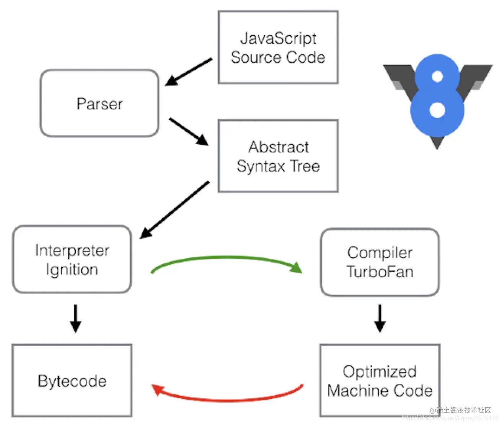

# 了解V8原理和JIT编译

## 认识V8

Google V8 是开源高性能 JavaScript 和 WebAssembly 引擎，被用于 Chrome 和 Node.js 等。
Chrome的市场占有率高达60%，而Node.js是JS后端编程的事实标准。国内的众多浏览器，其实都是基于Chromium浏览器开发，而Chromium相当于开源版本的Chrome，自然也是基于V8引擎的。神奇的是，就连浏览器界的独树一帜的Microsoft也投靠了Chromium阵营。另外，Electron是基于Node.js与Chromium开发桌面应用，也是基于V8的。

## V8高效的特征

### JIT编译

### 垃圾回收

虽然其他语言或者其他的 JavaScript 引擎实现都有垃圾回收，但是 V8 的垃圾回收借鉴了 Java VM 的精确垃圾回收管理，而其他很多语言的垃圾回收用的是保守垃圾管理

### 内联缓存（Inline Cache）

V8 使用了内联缓存的特性来提高属性的访问效率。如访问 this.prop，没有内联缓存的时候，每次都会对哈希表进行一次寻址，而加入了内联缓存的特性之后，V8 能马上知道这个属性的一个偏移
量，而不用再次计算寻址的偏移量了

### 隐藏类

由于 JavaScript 是一门动态的编程语言，因此哪怕是在 ES6 及以上版本的规范中有了class 的一个定义，开发者也能非常方便地对一个对象添加或者移除一个属性。
隐藏类就是对这样一套对象体系中的一个包装——所有属性一样的对象会被归为同一个隐藏类

## 内部结构

V8是一个非常复杂的项目，使用cloc统计可知，它竟然有超过100万行C++代码。
V8由许多子模块构成，其中这4个模块是最重要的：

- Parser：将 JavaScript 源码转换为 Abstract Syntax Tree (AST)；
- Ignition：解释器，将 AST 转换为 Bytecode，解释并执行 Bytecode；同时收集 TurboFan 优化编译所需的信息，比如函数参数的类型；
- TurboFan：编译器，利用Ignition所收集的类型信息，将Bytecode转换为优化的汇编代码（计算机可识别）；
- Orinoco：垃圾回收，负责将程序不再需要的内存空间回收。

> 什么是 Bytecode
：Bytecode 是介于AST和机器码之间的一种代码。与特定类型的机器码无关，Bytecode 需要通过解释器将其转换为机器码后才能执行。


> 为什么需要 Bytecode
：机器码的效率非常高效，但是需要消耗大量的内存来存放转换后的机器码。为了解决内存占用问题，就引入了 Bytecode，减少内存占用

### 解释器

在 V8 出现之前，所有的 JavaScript 虚拟机所采用的都是解释器来解释执行的方式，这是 JavaScript 执行速度过慢的主要原因之一。

`解释器的工作方式`：
边解释，边执行。 解析器解析代码，生成对应字节码，然后解释器直接解释执行字节码。这样子虽然启动快，但对于循环等会存在解释多次的情况。从而导致运行速度变慢，影响到js的执行效率。

```js
for (let i = 0; i < len; i++) {
  doSomething(i)
}
```

如何看到解释器生成的Bytecode：
Node.js是基于V8引擎实现的，因此node命令提供了很多V8引擎的选项，使用node的--print-bytecode选项，可以打印出Ignition生成的Bytecode。

factorial.js如下，由于V8不会编译没有被调用的函数，因此需要在最后一行调用factorial函数

```js
function factorial(N) {  
  if (N === 1) {  
    return 1;  
  } else {  
   return N * factorial(N - 1);  
  }  
}  
  
factorial(10); 

```

使用node命令(node版本为12.6.0)的--print-bytecode选项，打印出Ignition生成的Bytecode

> node --print-bytecode factorial.js 

然后就可以看到bytecode结果了

### JIT

为了解决解释器的低效问题，V8 把编译器也引入进来，结合了解释器和编译器两者优点设计了即时编译（JIT）的双轮驱动的设计，形成混合模式，给 JavaScript 的执行速度带来了极大的提升。
JIT，全称是 Just In Time，混合使用编译器和解释器的技术。

- 编译器启动速度慢，执行速度快
- 解释器的启动速度快，执行速度慢（之前的JS虚拟机采用方式）

> 绝大多数编译器以预先编译（AOT）或实时编译（JIT）形式工作。
> - 使用命令行或者集成开发环境（IDE）调用预先编译（AOT）的编译器，如 gcc
> - 实时编译器通常是用来提高性能的，令你没有感知的，如 V8

#### 实现思想

在 JavaScript 引擎中增加一个监视器（也叫分析器）。在解释器解释字节码的时候增加一个监视器（monitor），记录代码一共运行了多少次、如何运行的等信息。如果发现一段代码会被重复执行，则监视器会将此段代码标记为热点代码，同时交给V8提供的编译器对这段字节码进行编译，编译为二进制代码，然后再对编译后的二进制代码执行优化操作，从而提供其执行效率。等后面V8再次执行这段代码，则会跳过解释器，采用这段优化后的代码进行编译执行，从而提升代码的运行效率。

#### 转码过程

整个代码转换过程：JavaScript ==> AST ==> Bytecode ==> Machine Code



1. Parser：
使用 Parser 将 JavaScript 源码转换为 Abstract Syntax Tree (AST)


2. Interpreter：
使用解释器将 AST 转换为 Bytecode，然后解释执行 Bytecode。在Ignition执行字节码的过程中，发现某一行代码被执行了几次后，这行代码会被打上 Warm 的标签；当某一行代码被执行了很多次，这行代码会被打上 Hot 的标签。这些代码都称为热点代码。


3. Compiler
热点字节码会被 Compiler TurboFan 编译为高效的 Machine Code ，当再次执行这段被优化的代码时，只需要执行编译后的 Machine Code 就可以了，大大提升了代码的执行效率。


4. Baseline compiler：
Warm 标签的代码会被传给 Baseline Compiler  编译且储存，同时按照行数 (Line number) 和变量类型 (Variable type) 被索引。当发现执行的代码命中索引，会直接取出编译后的代码给浏览器执行，从而不需要重复编译已经编译过的代码。


5. Optimizing compiler：
被打上 Hot 标签的代码会被传给 Optimizing compiler，这里会对这部分代码做更优化的编译（类型假设）。在执行前会做类型检查，看是假设是否成立，如果不成立执行就会被打回 interpreter 或者 baseline compiler 的版本，Optimized Machine Code会被还原为Bytecode，这个过程叫做Deoptimization，也就是 “去优化”


总结如下：

- 如果函数没有被调用，则V8不会去编译它。
- 如果函数只被调用1次，则Ignition将其编译Bytecode就直接解释执行了。TurboFan不会进行优化编译，因为它需要Ignition收集函数执行时的类型信息。这就要求函数至少需要执行1次，TurboFan才有可能进行优化编译。
- 如果函数被调用多次，则它有可能会被识别为热点函数，且Ignition收集的类型信息证明可以进行优化编译的话，这时TurboFan则会将Bytecode编译为Optimized Machine Code，以提高代码的执行性能。


### 编译器优化过程

如何看到编译器生成的汇编代码： 使用node命令的--print-code以及--print-opt-code选项：

> node --print-code --print-opt-code factorial.js 

最后生成的汇编代码可读性很差，而且，机器的CPU类型不一样的话，生成的汇编代码也不一样。

我们先不管这些汇编代码，通过 add 函数来看看编译器具体是如何运作的

```js
function add(x, y) {  
  return x + y;  
}  
  
add(1, 2);  
add(3, 4);  
add(5, 6);  
add("7", "8");


```

由于JS的变量是没有类型的，所以add函数的参数可以是任意类型：Number、String、Boolean等，如果直接编译的话，生成的汇编代码比如会有很多if…else分支，伪代码如下：

```js
if (isInteger(x) && isInteger(y)) {
    // 整数相加
} else if (isFloat(x) && isFloat(y)) {
    // 浮点数相加
} else if (isString(x) && isString(y)) {
    // 字符串拼接
} else {
    // 各种其他情况，很长
}

```

Ignition在执行add(1, 2)时，已经知道add函数的两个参数都是整数，那么TurboFan在编译Bytecode时，就可以假定add函数的参数是整数，这样可以极大地简化生成的汇编代码，伪代码如下：

```js
if (isInteger(x) && isInteger(y)) {
    // 整数相加
} else {
    // Deoptimization
}


```

接下来的add(3, 4)与add(3, 4)可以执行优化的汇编代码，但是add("7", "8")只能Deoptimize为Bytecode来执行。
当然，TurboFan所做的也不只是根据类型信息来简化代码执行流程，它还会进行其他优化，比如减少冗余代码等更复杂的事情。

> 我们可以看出，如果我们的JS代码中变量的类型变来变去，是会给V8引擎增加不少麻烦的，为了提高性能，我们可以尽量不要去改变变量的类型，少使用delete等操作，同时推荐使用typescript这种静态语言支持的语言进行编码。

## JIT 弊端

JIT混合了编译器，必然会多一些开销

- 优化和去优化开销
- 监视器记录信息对内存的开销
- 发生去优化情况时恢复信息的记录对内存的开销
- 对基线版本和优化后版本记录的内存开销
所以，整体来看是一个空间换时间的优化方案。


 