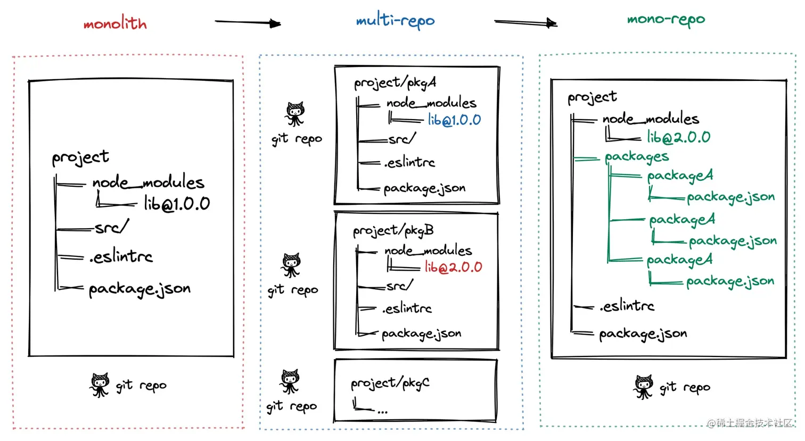
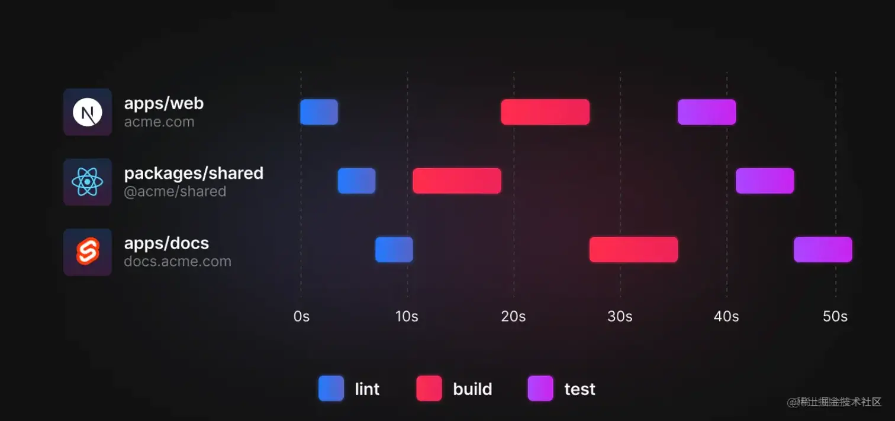
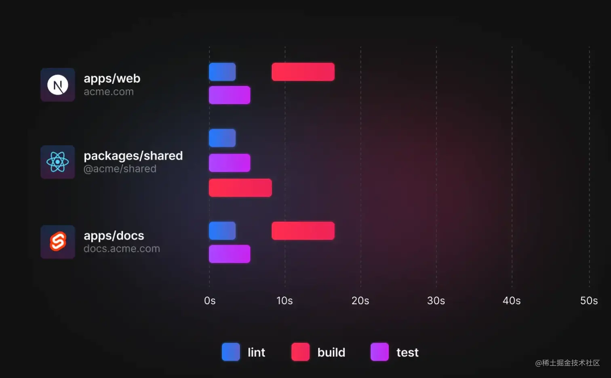
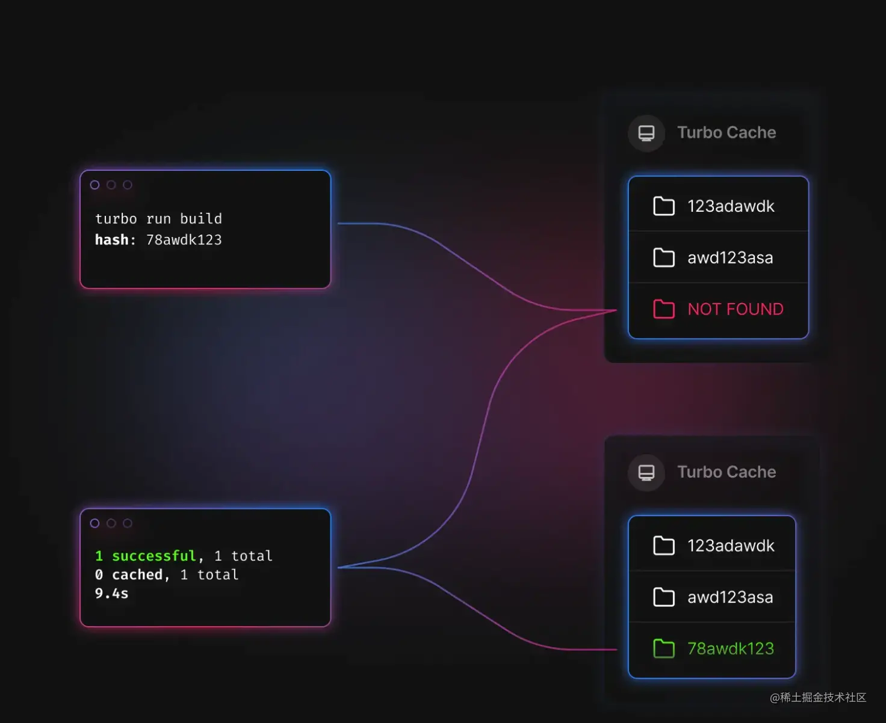
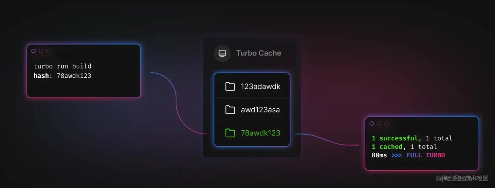
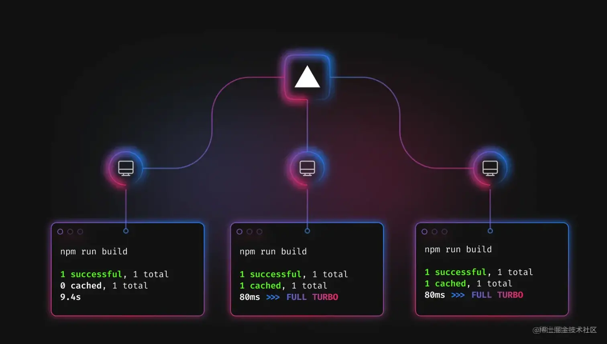

# 带你了解更全面的 Monorepo - 优劣、踩坑、选型

## 一、Monorepo 介绍

Monorepo 是一种项目代码管理方式，指单个仓库中管理多个项目，有助于简化代码共享，版本控制，构建和部署等多方面的复杂性,并提供更好的可重用性和协作性。monorepo 提倡了开放，透明，共享的组织文化，这种方法已经被很多大型公司广泛使用，如 Google、Facebook 和 Microsoft 等。

## 二、Monorepo 演进

### 阶段一：单仓库巨石应用，

一个 Git 仓库维护着项目代码，随着迭代业务复杂度的提升，项目代码会变得越来越多，越来越复杂，大量代码构建效率也会降低，最终导致了单体巨石应用，这种代码管理方式称之为 Monolith。

### 阶段二：多仓库多模块应用

于是将项目拆解成多个业务模块，并在多个 Git 仓库管理，模块解耦，降低了巨石应用的复杂度，每个模块都可以独立编码、测试、发版，代码管理变得简化，构建效率也得以提升，这种代码管理方式称之为 MultiRepo。

### 阶段三：单仓库多模块应用

随着业务复杂度的提升，模块仓库越来越多，MultiRepo 这种方式虽然从业务上解耦了，但增加了项目工程管理的难度，随着模块仓库达到一定数量级，会有几个问题：跨仓库代码难共享；分散在单仓库的模块依赖管理复杂（底层模块升级后，其他上层依赖需要及时更新，否则有问题）；增加了构建耗时。于是将多个项目集成到一个仓库下，共享工程配置，同时又快捷地共享模块代码，成为趋势，这种代码管理方式称之为 MonoRepo。


## 三、Monorepo 优劣

| 场景      | MultiRepo | MonoRepo |
| ----------- | ----------- | ----------- |
| 代码可见性      | ✅ 代码隔离，研发者只需关注自己负责的仓库<br/>❌ 包管理按照各自owner划分，当出现问题时，需要到依赖包中进行判断并解决。       | ✅ 一个仓库中多个相关项目，很容易看到整个代码库的变化趋势，更好的团队协作。<br/>❌ 增加了非owner改动代码的风险       |
| 依赖管理      | ❌ 多个仓库都有自己的 node_modules，存在依赖重复安装情况，占用磁盘内存大。       | ✅ 多项目代码都在一个仓库中，相同版本依赖提升到顶层只安装一次，节省磁盘内存       |
| 代码权限   | ✅ 各项目单独仓库，不会出现代码被误改的情况，单个项目出现问题不会影响其他项目。        | ❌ 多个项目代码都在一个仓库中，没有项目粒度的权限管控，一个项目出问题，可能影响所有项目。       |
| 开发迭代      | ✅ 仓库体积小，模块划分清晰，可维护性强。<br/>❌ 多仓库来回切换（编辑器及命令行），项目多的话效率很低。多仓库见存在依赖时，需要手动 npm link，操作繁琐。<br/>❌ 依赖管理不便，多个依赖可能在多个仓库中存在不同版本，重复安装，npm link 时不同项目的依赖会存在冲突。| ✅ 多个项目都在一个仓库中，可看到相关项目全貌，编码非常方便。<br/>✅ 代码复用高，方便进行代码重构。<br/>❌ 多项目在一个仓库中，代码体积多大几个 G，git clone时间较长。<br/>✅ 依赖调试方便，依赖包迭代场景下，借助工具自动 npm link，直接使用最新版本依赖，简化了操作流程。|
| 工程配置      | ❌ 各项目构建、打包、代码校验都各自维护，不一致时会导致代码差异或构建差异。 | ✅ 多项目在一个仓库，工程配置一致，代码质量标准及风格也很容易一致。 |
| 构建部署      | ❌ 多个项目间存在依赖，部署时需要手动到不同的仓库根据先后顺序去修改版本及进行部署，操作繁琐效率低。 | ✅ 构建性 Monorepo 工具可以配置依赖项目的构建优先级，可以实现一次命令完成所有的部署。 |

## 四、Menorepo场景

综合如上 Monorepo VS MultiRepo，中大型项目，多模块项目，更适合用 MonoRepo 方式管理代码，在开发、协作效率、代码一致性方面都能受益。

## 五、Monorepo踩坑

### 5.1 幽灵依赖

`问题`：npm/yarn 安装依赖时，存在依赖提升，某个项目使用的依赖，并没有在其 package.json 中声明，也可以直接使用，这种现象称之为 “幽灵依赖”；随着项目迭代，这个依赖不再被其他项目使用，不再被安装，使用幽灵依赖的项目，会因为无法找到依赖而报错。

`方案`：基于 npm/yarn 的 Monorepo 方案，依然存在 “幽灵依赖” 问题，我们可以通过 pnpm 彻底解决这个问题

### 5.2 依赖安装耗时长

`问题`：MonoRepo 中每个项目都有自己的 package.json 依赖列表，随着 MonoRepo 中依赖总数的增长，每次 install 时，耗时会较长。

`方案`：相同版本依赖提升到 Monorepo 根目录下，减少冗余依赖安装；使用 pnpm 按需安装及依赖缓存。

### 5.3 构建打包耗时长

`问题`：多个项目构建任务存在依赖时，往往是串行构建 或 全量构建，导致构建时间较长

`方案`：增量构建，而非全量构建；也可以将串行构建，优化成并行构建。

## 六、Monorepo选型

### 6.1 构建型Monorepo方案

此类工具，主要解决大仓库 Monorepo 构建效率低的问题。项目代码仓库越来越庞大，工作流（int、构建、单元测试、集成测试）也会越来越慢；这类工具，是专门针对这样的场景进行极致的性能优化。适用于包非常多、代码体积非常大的 Monorepo 项目。

#### 6.1.1 Turborepo

Turborepo 是 Vercel 团队开源的高性能构建代码仓库系统，允许开发者使用不同的构建系统。

构建加速思路：

- Multiple Running Task：构建任务并行进行，构建顺序交给开发者配置
- Cache、Remote Cache：通过缓存 及 远程缓存，减少构建时间

举例 Multiple Running Task：我们现在有一个 Monorepo 的项目，有以下几个 package：

- apps/web，依赖 shared
- apps/docs，依赖 shared
- package/shared，被 web 和 docs 依赖

```js
# 当我们使用正常的 yarn workspace 去管理 monorepo 的工作流任务时，例如执行以下命令：
yarn workspaces run lint
yarn workspaces run test
yarn workspaces run build
```

传统的 yarn workspace 问题：串行构建，性能差



Turborepo Multiple Running Task：允许用户在 turbo.json 中声明 task 之间依赖关系，优化后构建如下



举例 Local Cache：第一次`trubo run build`后，会生成缓存存放在 `node_modules/.cache/turbo/`



（第一次构建示意图）



（第二次构建示意图）

举例 Remote Cache：想要在 CI/CD 或团队中共享打包缓存，把缓存保存到了云端，构建时被拉取



（远程缓存构建示意图）

### 6.2 轻量化Monorepo方案

#### 6.2.1 Lerna

lerna是什么？
- Lerna 是 Babel 为实现 Monorepo 开发的工具；最擅长管理依赖关系和发布
- Lerna 优化了多包工作流，解决了多包依赖、发版手动维护版本等问题
- Lerna 不提供构建、测试等任务，工程能力较弱，项目中往往需要基于它进行顶层能力的封装

Lerna 主要做三件事

- 为单个包或多个包运行命令 (lerna run)
- 管理依赖项 (lerna bootstrap)
- 发布依赖包，处理版本管理，并生成变更日志 (lerna publish)