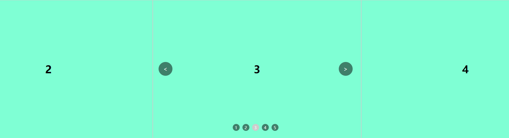
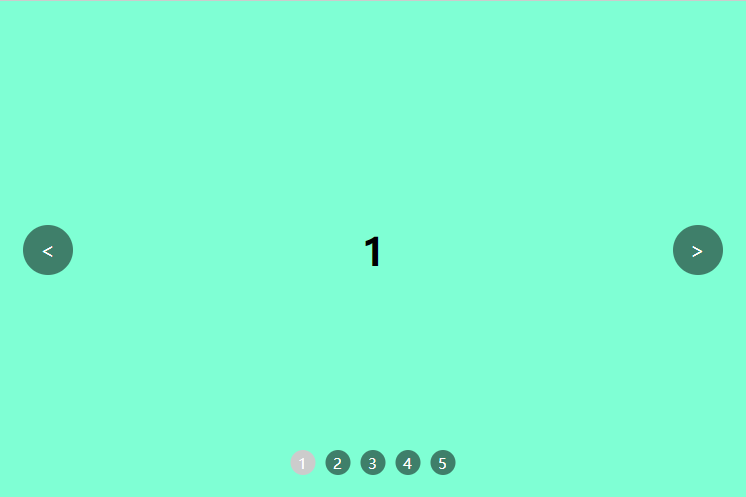

# 如何实现一个轮播图组件？

## 1. 原理介绍
<HR/>
轮播图的原理其实不是太复杂，主要可以总结为两点：

- 定位的运用
- 定时器的运用
上面两点主要是轮播图实现方法中比较重要的两点，通过下面两张图，大家可以更加容易理解轮播图的原理：



上面图中的1、2、3、4...等盒子可以看作为一张张的图片，它们横向依次排列。最外层还有一个父级盒子，它的宽度刚好就是一张图片的宽度，第一张图没有设置隐藏超出部分，第二张图隐藏了超出部分。

让我们的图片位置不断变化，让它出现在可视区内，加上一些动画，就变成了我们想要的轮播图了。

## 2. 实现的效果

知道了大概的原理，那么接下来我们一起理一下需要实现的效果：

- 图片自动轮播
- 轮播有动画效果
- 点击左右按钮可切换
- 点击数字按钮切换到对应图片
- 数字按钮有选中的效果
- 鼠标移入停止自动播放

## 3. 具体实现方式

### 3.1 HTML布局

从上图可以看出，HTML布局很简单，主要分为了三部分：左右切换按钮、图片列表、底部数字切换按钮。

代码如下：

```js
<div class="container">
    <!--  图片列表  -->
    <ul class="ul-img">
      <li class="li-img">1</li>
      <li class="li-img">2</li>
      <li class="li-img">3</li>
      <li class="li-img">4</li>
      <li class="li-img">5</li>
    </ul>

    <!--  上一张、下一张按钮  -->
    <div class="prev">
      <span>&lt;</span>
    </div>
    <div class="next">
      <span>&gt;</span>
    </div>

    <!-- 数字切换按钮 -->
    <div class="num-box">
      <ul class="num-ul">
        <li data-index="0">1</li>
        <li data-index="1">2</li>
        <li data-index="2">3</li>
        <li data-index="3">4</li>
        <li data-index="4">5</li>
      </ul>
    </div>
</div>
```
这里需要注意的一点是我们给数字切换按钮的li标签添加了一个自定义属性，因为后面我们在js中需要用到，用来判断与哪一张图片对应，方便设置选中效果。

### 3.2 CSS样式

我们需要将图片列表排成一排，并且让最外层的盒子设置超出隐藏，其它两个部分可以定位到对应的位置，代码如下：

```js
.container {
  position: relative;
  width: 600px;
  height: 400px;
  margin: 0 auto;
  background-color: gray;
  overflow: hidden;
}

.ul-img {
  position: absolute;
  display: flex;
  width: 4200px;
  height: 400px;
  left: 0;
  padding: 0;
  margin: 0;
}

.li-img {
  list-style: none;
  width: 600px;
  height: 400px;
  display: flex;
  align-items: center;
  justify-content: center;
  background-color: aquamarine;
  font-size: 30px;
  font-weight: 800;
  border: 1px solid #ccc;
}

/* 上一张、下一张 */
.prev,
.next {
  position: absolute;
  height: 400px;
  width: 80px;
  display: flex;
  justify-content: center;
  align-items: center;
  top: 0;
}

.prev {
  left: 0;
}

.next {
  right: 0;
}

.prev span,
.next span {
  display: block;
  color: #fff;
  width: 40px;
  height: 40px;
  display: flex;
  justify-content: center;
  align-items: center;
  background-color: rgba(0, 0, 0, 0.5);
  border-radius: 50%;
  cursor: pointer;
}

/* 数字切换按钮 */
.num-box {
  position: absolute;
  left: 50%;
  bottom: 20px;
  transform: translate(-50%, 0);
  z-index: 2;
}

.num-ul {
  list-style: none;
  margin: 0;
  padding: 0;
  display: flex;
}

.num-ul li {
  height: 20px;
  width: 20px;
  border-radius: 50%;
  background-color: rgba(0, 0, 0, 0.5);
  display: flex;
  justify-content: center;
  align-items: center;
  font-size: 9px;
  color: #fff;
  margin: 0 4px;
  cursor: pointer;
  user-select: none;
}
```

这个时候基本的样式就出来了，只是还不能轮播，一直显示的都是第一张图片

到这里我们的基础布局算是实现了，但是离我们的需求还有一段距离，重点在js部分。

### 3.3 JS代码

JS逻辑代码才是实现我们整个需求的核心部分，先整体过一下代码，我们再来讲解：

```js
// 获取元素节点
var containerDom = document.getElementsByClassName("container")[0]; // 容器
var ulDom = document.getElementsByClassName("ul-img")[0]; // 图片盒子
var prevDom = document.getElementsByClassName("prev")[0].firstElementChild; // 上一张按钮
var nextDom = document.getElementsByClassName("next")[0].firstElementChild; // 下一张按钮
var numUlDom = document.getElementsByClassName("num-ul")[0]; // 数字按钮父级容器
var numList = document
  .getElementsByClassName("num-ul")[0]
  .getElementsByTagName("li"); // 数字切换按钮列表

// 定义全局变量
var currentIndex = 0; // 当前显示的图片索引
var timer = null; // 自动播放定时器
numList[currentIndex].style.backgroundColor = "#ccc"; // 默认选中第一个数字
// 上一张
prevDom.addEventListener("click", prevFun);
// 下一张
nextDom.addEventListener("click", nextFun);
// 鼠标移入容器，停止自动播放
containerDom.addEventListener("mouseenter", stopAutoPlay);
// 鼠标移出容器，开启自动播放
containerDom.addEventListener("mouseleave", autoPlay);
// 数字按钮点击事件
numUlDom.addEventListener("click", numClick);

// 开启自动播放
autoPlay();

// 切换上一张
function prevFun() {
  ulDom.style.transition = "0.5s";
  numList[currentIndex].style.backgroundColor = ""; // 清空上一个按钮的样式
  if (currentIndex === 0) {
    ulDom.style.transition = "0s"; // 为了实现无缝滚动，清除动画
    currentIndex = 4;
  } else {
    --currentIndex;
  }
  ulDom.style.left = `-${currentIndex * 600}px`;
  numList[currentIndex].style.backgroundColor = "#ccc";
}

// 切换下一张
function nextFun() {
  ulDom.style.transition = "0.5s";
  numList[currentIndex].style.backgroundColor = ""; // 清空上一个按钮的样式
  if (currentIndex === 4) {
    ulDom.style.transition = "0s"; // 为了实现无缝滚动，清除动画
    currentIndex = 0; // 重新播放第一张
  } else {
    ++currentIndex;
  }
  ulDom.style.left = `-${currentIndex * 600}px`;
  numList[currentIndex].style.backgroundColor = "#ccc"; // 设置按钮选中样式
}

// 数字按钮点击事件
function numClick(e) {
  ulDom.style.transition = "0.5s";
  let index = e.target.dataset.index;
  if (index == undefined) {
    return;
  }
  numList[currentIndex].style.backgroundColor = ""; // 清空上一个按钮的样式
  currentIndex = Number(index);
  numList[currentIndex].style.backgroundColor = "#ccc";
  ulDom.style.left = `-${currentIndex * 600}px`;
}

// 循环播放
function autoPlay() {
  timer = setInterval(nextFun, 1000);
}

// 关闭自动播放
function stopAutoPlay() {
  // 清除定时器
  clearInterval(timer);
}
```

js里面主要有几个方法，这里讲解一两个大家就懂了，比如说我们需要点击按钮切换上一张或者下一张图片，主要实现方法如下：

```js
function nextFun() {
  ulDom.style.transition = "0.5s";
  numList[currentIndex].style.backgroundColor = ""; // 清空上一个按钮的样式
  if (currentIndex === 4) {
    ulDom.style.transition = "0s"; // 为了实现无缝滚动，清除动画
    currentIndex = 0; // 重新播放第一张
  } else {
    ++currentIndex;
  }
  ulDom.style.left = `-${currentIndex * 600}px`;
  numList[currentIndex].style.backgroundColor = "#ccc"; // 设置按钮选中样式
}

```
当我们点击切换按钮式，首先清除掉上一个数字按钮的选中样式，然后判断是否是最后一张图片或者第一张图片。我们声明了一个全局变量currentIndex用来存储当前展示的是第几张图片。

然后通过currentIndex动态计算改变需要展示的图片的left距离。

自动播放和点击数字按钮切换图片得到原理都和这个方法类似，都是需要计算出需要展示的图片的left。

### 3.4 核心方法

js部分我们大概有五个主要的方法：

- prevFun()：点击切换上一张
- nextFun()：点击切换下一张
- numClick(e)：点击数字按钮
- autoPlay()：循环播放轮播
- stopAutoPlay()：关闭自动播放

## 总结

轮播图实现起来并不难，难的是有没有耐心。轮播图无非就是让一排图片中的某一张图片在合适的时间出现在合适的区域内。

当然实现轮播图的方式和方法都有很多，比如用纯CSS也能实现轮播图，主要看个人需求而定。