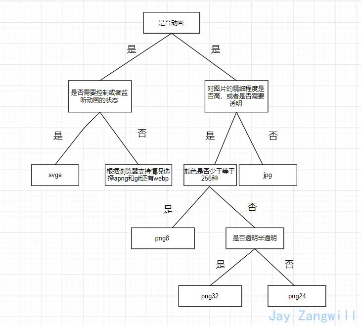

# 前端该如何选择图片的格式？

## 图片的类型

图片的类型目前就分为两种：

- 位图
- 矢量图

## 位图

所谓位图就是用像素点拼起来的图也叫点阵图，平时我们用到的png、jpg等图片就是位图。

## 矢量图

矢量图，也叫做向量图。矢量图并不纪录画面上每一点的信息，而是纪录了元素形状及颜色的算法，当你打开一幅矢量图的时候，软件对图形对应的函数进行运算，将运算结果图形的形状和颜色显示给你看。

无论显示画面是大还是小，画面上的对象对应的算法是不变的，所以，即使对画面进行倍数相当大的缩放，它也不会像位图那样会失真。

常见的就是svg格式的。

## 图片的压缩类型

- 无压缩
- 有损压缩
- 无损压缩

## 无压缩

无压缩的图片格式不对图片数据进行压缩处理，能准确地呈现原图片。例如BMP格式的图片。

## 有损压缩

指在压缩文件大小的过程中，损失了一部分图片的信息，也即降低了图片的质量（即图片被压糊了），并且这种损失是不可逆的。

常见的有损压缩手段是按照一定的算法将临近的像素点进行合并。压缩算法不会对图片所有的数据进行编码压缩，而是在压缩的时候，去除了人眼无法识别的图片细节。因此有损压缩可以在同等图片质量的情况下大幅降低图片的体积。例如jpg格式的图片使用的就是有损压缩。

## 无损压缩

在压缩图片的过程中，图片的质量没有任何损耗。我们任何时候都可以从无损压缩过的图片中恢复出原来的信息。

压缩算法对图片的所有的数据进行编码压缩，能在保证图片的质量的同时降低图片的体积。例如png、gif使用的就是无损压缩。

## 图片位数

图片位数通常分为8、16、24、32

- 图片位数越大，能表示的颜色越多，同时占用的体积也约大。例如8位图片支持256种颜色，即2的8次方。
- 图片位数越大，颜色过渡也就越细腻，携带的色彩信息可以更加丰富。
- 32位跟24位的区别就是多了一个Alpha通道，用来支持半透明，其他的跟24位基本一样。

## 常见的图片的格式

### GIF

GIF的全称是Graphics Interchange Format，可译为图形交换格式，是在1987年由Compu Serve公司为了填补跨平台图像格式的空白而发展起来的。

GIF采用的是Lempel-Zev-Welch（LZW）压缩算法，最高支持256种颜色。由于这种特性，GIF比较适用于色彩较少的图片，比如卡通造型、公司标志等等。如果碰到需要用24位真彩色的场合，那么GIF的表现力就有限了。

GIF格式图片最大的特性是帧动画，相比古老的bmp格式，尺寸较小，而且支持透明(不支持半透明，因为不支持 Alpha 透明通道 )和动画。

优点：

- 体积小
- 支持动画

缺点：

- 由于采用了8位压缩，最多只能处理256种颜色

### JPEG/JPG
JPEG是Joint Photographic Experts Group(联合图像专家组)的缩写，文件后辍名为"．jpg"或"．jpeg"，是常用的图像文件格式，由一个软件开发联合会组织制定，是一种有损压缩格式，能够将图像压缩在很小的储存空间，图像中重复或不重要的资料会被丢失，因此容易造成图像数据的损伤。尤其是使用过高的压缩比例，将使最终解压缩后恢复的图像质量明显降低，如果追求高品质图像，不宜采用过高压缩比例。

优点：

- 采用有损压缩，压缩后体积更小
- 支持24位真彩色
- 支持渐进式加载

缺点：

- 有损压缩会损坏图片的质量
- 不支持透明/半透明
### 渐进式jpeg(progressive jpeg)

渐进式jpg文件包含多次扫描，这些扫描顺寻的存储在jpg文件中。打开文件过程中，会先显示整个图片的模糊轮廓，随着扫描次数的增加，图片变得越来越清晰。

### PNG

png，即便携式网络图形是一种无损压缩的位图片形格式，其设计目的是试图替代GIF和TIFF文件格式，同时增加一些GIF文件格式所不具备的特性。PNG使用从LZ77派生的无损数据压缩算法，一般应用于JAVA程序、网页或S60程序中，原因是它压缩比高，生成文件体积小。

png支持8位、24位、32位3种，我们通常叫它们png8、png24、png32。

优点：

- 无损压缩
- 支持透明、半透明
- 最高支持24位真彩色图像以及8位灰度图像，从而彻底地消除锯齿边缘。

缺点：

- 与jpg的有损耗压缩相比，png提供的压缩量较少
- 不支持动画，如需支持动画还得使用apng

### APNG

APNG（Animated Portable Network Graphics）是一个基于PNG（Portable Network Graphics）的位图动画格式。实际上就是多张png组成的动图。MAC电脑打开可以看到组成apng的每一张图。

优点：

- 支持png的所有优点
- 支持动画

缺点：

- 浏览器支持情况较差

### WEBP

WebP是由Google最初在2010年发布，目标是减少文件大小。它能同时支持无损压缩和有损压缩。

它几乎集成了以上所有图片的优点，并且能够拥有更高的压缩率，但是浏览器支持率还不够理想。

### SVG

SVG是一种用XML定义的语言，用来描述二维矢量及矢量/栅格图形。SVG提供了3种类型的图形对象：矢量图形（例如：由直线和曲线组成的路径）、图象、文本。图形对象还可进行分组、添加样式、变换、组合等操作，特征集包括嵌套变换、剪切路径、alpha蒙板、滤镜效果、模板对象和其它扩展。

SVG图形是可交互的和动态的，可以在SVG文件中嵌入动画元素或通过脚本来定义动画。

SVG与上面图片不同的是它是矢量图，无论你怎么放大，它都不会失真；同时，SVG文件通常要比比JPEG和PNG格式的文件要小很多。

优点：

- SVG 可被非常多的工具读取和修改（比如记事本）
- SVG 与 JPEG 和 GIF 图像比起来，尺寸更小，且可压缩性更强。
- SVG 是可伸缩
- SVG 图像可在任何的分辨率下被高质量地打印
- SVG 可在图像质量不下降的情况下被放大
- SVG 可以与 JavaScript 技术一起运行
- SVG 文件是纯粹的 XML
缺点：

- 渲染成本相对于其他格式图片比较高，对于性能有影响。
- 需要学习成本，因为SVG是一种用XML定义的语言。

如何选择图片的格式

