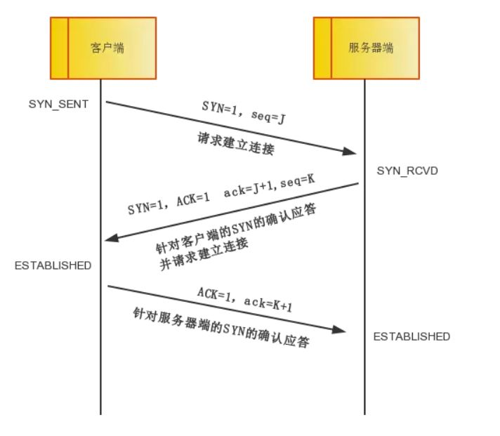
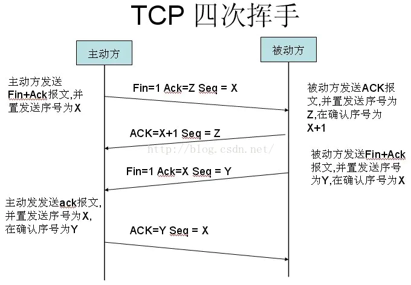

# 简单描述从输入网址到页面显示的过程

很多大公司面试喜欢问这样一道面试题，输入URL到看见页面发生了什么？

简单来说，共有以下几个过程：

- DNS解析
- 发起TCP连接
- 发送HTTP请求
- 服务器处理请求并返回HTTP报文
- 浏览器解析渲染页面
- 连接结束

下面我们来看看具体的细节。

##  DNS解析

DNS解析实际上就是寻找你所需要的资源的过程。假设你输入www.baidu.com，而这个网址并不是百度的真实地址，互联网中每一台机器都有唯一标识的IP地址，这个才是关键，但是它不好记，乱七八糟一串数字谁记得住啊，所以就需要一个网址和IP地址的转换，也就是DNS解析。

DNS解析其实是一个递归的过程。

输入www.google.com网址后，首先在本地的域名服务器中查找，没找到去根域名服务器查找，没有再去com顶级域名服务器查找，，如此的类推下去，直到找到IP地址，然后把它记录在本地，供下次使用。大致过程就是.-> .com ->google.com. -> www.google.com.。 (最后这个.对应的就是根域名服务器，默认情况下所有的网址的最后一位都是.，为了方便用户，通常都会省略，浏览器在请求DNS的时候会自动加上)

## DNS优化

既然已经懂得了解析的具体过程，我们可以看到上述一共经过了N个过程，每个过程有一定的消耗和时间的等待，因此我们得想办法解决一下这个问题！

- DNS缓存
DNS存在着多级缓存，从离浏览器的距离排序的话，有以下几种: 浏览器缓存，系统缓存，路由器缓存，IPS服务器缓存，根域名服务器缓存，顶级域名服务器缓存，主域名服务器缓存。

- DNS负载均衡
比如访问baidu.com的时候，每次响应的并非是同一个服务器（IP地址不同），一般大公司都有成百上千台服务器来支撑访问。DNS可以返回一个合适的机器的IP给用户，例如可以根据每台机器的负载量，该机器离用户地理位置的距离等等，这种过程就是DNS负载均衡。

## 发起TCP连接
TCP提供一种可靠的传输，这个过程涉及到三次握手，四次挥手。

三次握手

- 第一次握手：
客户端发送syn包(Seq=x)到服务器，并进入SYN_SEND状态，等待服务器确认；

- 第二次握手：
服务器收到syn包，必须确认客户的SYN（ack=x+1），同时自己也发送一个SYN包（Seq=y），即SYN+ACK包，此时服务器进入SYN_RECV状态；

- 第三次握手：
客户端收到服务器的SYN＋ACK包，向服务器发送确认包ACK(ack=y+1)，此包发送完毕，客户端和服务器进入ESTABLISHED状态，完成三次握手。

握手过程中传送的包里不包含数据，三次握手完毕后，客户端与服务器才正式开始传送数据。理想状态下，TCP连接一旦建立，在通信双方中的任何一方主动关闭连接之前，TCP 连接都将被一直保持下去。

## 四次挥手
数据传输完毕后，双方都可释放连接。最开始的时候，客户端和服务器都是处于ESTABLISHED状态，假设客户端主动关闭，服务器被动关闭。

- 第一次挥手：
客户端发送一个FIN，用来关闭客户端到服务器的数据传送，也就是客户端告诉服务器：我已经不 会再给你发数据了(当然，在fin包之前发送出去的数据，如果没有收到对应的ack确认报文，客户端依然会重发这些数据)，但是，此时客户端还可以接受数据。

FIN=1，其序列号为seq=u（等于前面已经传送过来的数据的最后一个字节的序号加1），此时，客户端进入FIN-WAIT-1（终止等待1）状态。 TCP规定，FIN报文段即使不携带数据，也要消耗一个序号。

- 第二次挥手：
服务器收到FIN包后，发送一个ACK给对方并且带上自己的序列号seq，确认序号为收到序号+1（与SYN相同，一个FIN占用一个序号）。此时，服务端就进入了CLOSE-WAIT（关闭等待）状态。TCP服务器通知高层的应用进程，客户端向服务器的方向就释放了，这时候处于半关闭状态，即客户端已经没有数据要发送了，但是服务器若发送数据，客户端依然要接受。这个状态还要持续一段时间，也就是整个CLOSE-WAIT状态持续的时间。

此时，客户端就进入FIN-WAIT-2（终止等待2）状态，等待服务器发送连接释放报文（在这之前还需要接受服务器发送的最后的数据）。

- 第三次挥手：
服务器发送一个FIN，用来关闭服务器到客户端的数据传送，也就是告诉客户端，我的数据也发送完了，不会再给你发数据了。由于在半关闭状态，服务器很可能又发送了一些数据，假定此时的序列号为seq=w，此时，服务器就进入了LAST-ACK（最后确认）状态，等待客户端的确认。

- 第四次挥手：
主动关闭方收到FIN后，发送一个ACK给被动关闭方，确认序号为收到序号+1，此时，客户端就进入了TIME-WAIT（时间等待）状态。注意此时TCP连接还没有释放，必须经过2∗MSL（最长报文段寿命）的时间后，当客户端撤销相应的TCB后，才进入CLOSED状态。

服务器只要收到了客户端发出的确认，立即进入CLOSED状态。同样，撤销TCB后，就结束了这次的TCP连接。可以看到，服务器结束TCP连接的时间要比客户端早一些。

至此，完成四次挥手。

## 发送HTTP请求
发送HTTP请求，就是构建HTTP请求报文，并通过TCP协议，发送到服务器指定端口。

请求报文由请求行，请求报头，请求正文组成。

## 服务器处理请求并返回HTTP报文
对TCP连接进行处理，对HTTP协议进行解析，并按照报文格式进一步封装成HTTP Request对象，供上层使用。这一部分工作一般是由Web服务器去进行，比如Tomcat, Nginx和Apache等Web服务器。

HTTP报文也分成三段：状态码，响应报头和响应报文。

## 浏览器解析渲染页面

这个图就是Webkit解析渲染页面的过程。

- 解析HTML形成DOM树
- 解析CSS形成CSSOM 树
- 合并DOM树和CSSOM树形成渲染树
- 浏览器开始渲染并绘制页面