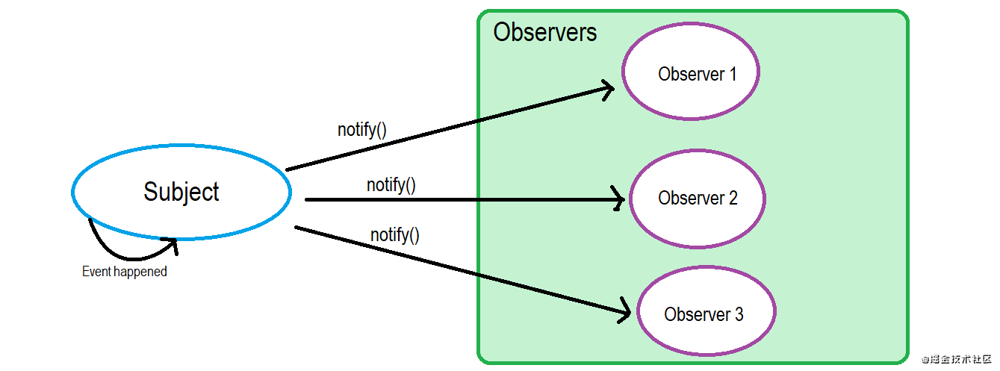
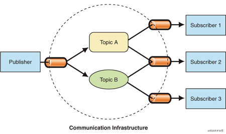
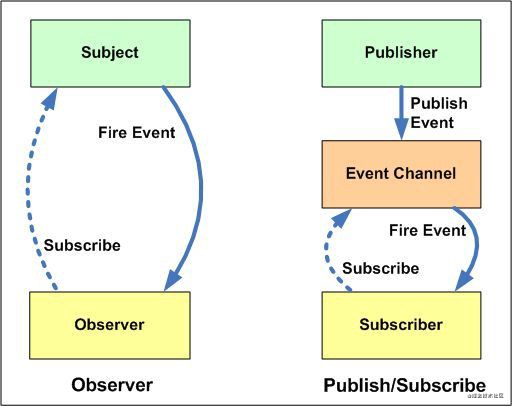

# 观察者模式和发布订阅模式分别是什么？有什么区别？

观察者模式：一个对象（观察者）订阅另一个对象（主题），当主题被激活的时候，触发观察者里面的事件。

发布订阅模式：订阅者把自己想要订阅的事件注册到调度中心，当发布者发布事件到调度中心（就是该事件被触发），再由调度中心统一调度订阅者注册到调度中心的处理代码

对比一下：

可以发现两种模式下的角色数量不一样：

- 观察者模式里，只有两个角色：观察者 和 被观察者
- 发布订阅模式里，却不仅仅只有发布者和订阅者两个角色，还有一个调度中心
- 
从使用场景上：

- 观察者模式比较适合在单个应用内部使用
- 发布订阅模式则是比较适合跨应用的场景